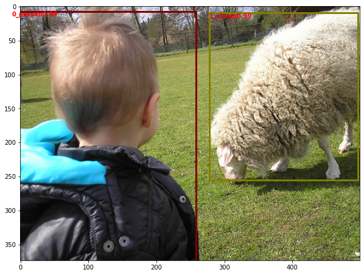
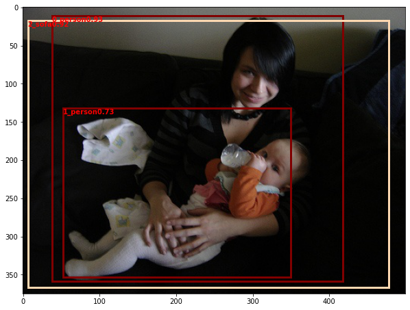
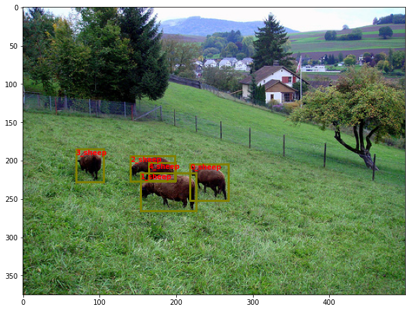

# SSD
This is a PyTorch implemented model for object detection.

The aim is to build a model that can detect and localize objects (belonging to a set of categories) present in the image.

# Model Details
There are two models that I have implemented, one is ResNet-34 based, and the other is VGG based (as mentioned in
the SSD research paper).

Results on a smaller training-validation dataset showed that VGG based giving better results, so here I will discuss
that only. VGG backbone is used, with the fc layers converted to convolutional layers
by using sub-sampling techniques.


Features from different depths are all used in the task because these features
have different scales as it helps in detecting and localizing the objects of
various sizes. As mentioned in the paper, "To handle different object scales,
some methods [4,9] suggest processing the image at different sizes and combining the
results afterward. However, by utilizing feature maps from several different layers in a
single network for prediction we can mimic the same effect, while also sharing parameters across all object scales."

# Loss Function
There is a fixed set of priors of different scales and aspect ratios pre-defined for all
input images. The priors which have IOU with ground truth boxes more than some threshold
are called are positive one, otherwise negative one. For the loss function
CCE loss is used for classification and L1 loss is used for generating bounding box
coordinates.

Hard Negative Mining is used because most of the priors don't have an object, which can lead to a model which is trained to detect background, rather than
An object. To balance this problem what can we do is we can find out the anchors where the model was sure it is no background, but ground-truth was background,
i.e those anchors where the model detects background poorly and we can include those anchors' cce in the loss.
The combined effect is model is trained to find objects and also trained to differentiate whether background or not.


# Results
~~I have tried training on PASCAL VOC 2007 trainval dataset, without augmentations, and it resulted in overfitting
on the training dataset. I will be training it on combined PASCAL VOC 2007
trainval + PASCAL VOC 2012 trainval, and will also add augmentations. The new model and its results
will be available soon.~~
I have trained on PASCAL VOC 2007 + 2012 trainval dataset, and 10% out of this
 is kept for validation purpose.
Model trained parameters could be taken from
https://drive.google.com/file/d/1pPYFl19F-Wjgb4ZGU5gklPS9QY0t6atq/view?usp=sharing

Loss function is plotted below:


## Inference Results On Validation Dataset
(in pairs of two, above one is gt and below one is prediction:











## Some poor inference results


## Mean Average Precision On valid dataset
```
aeroplane     0.8036947405368459
bicycle       0.698565424842797
bird          0.7126576208295337
boat          0.39513511180177846
bottle        0.38318830760691225
bus           0.695965324997583
car           0.6139925449663699
cat           0.7981757562559689
chair         0.35375536843191724
cow           0.758707701759419
diningtable   0.5588068962815412
dog           0.7839854123815028
horse         0.7932229413225481
motorbike     0.7195893890809145
person        0.6032555593079002
pottedplant   0.3975473311358504
sheep         0.6827481950025204
sofa          0.5751202403413541
train         0.8158205430932703
tvmonitor     0.7833504396591248

mean average precision 0.6463642424817827

```


## Mean Average Precision On train dataset
```
aeroplane	0.8923473481918613
bicycle	        0.8069938335728608
bird	        0.8078259254077249
boat    	0.6874771543609579
bottle	        0.4836754093457955
bus     	0.8135060208519707
car     	0.7090754231514288
cat	        0.9087417542601393
chair   	    0.6514008772360029
cow	        0.7190768175403235
diningtable	0.7626571280094901
dog     	0.9076054353141836
horse	        0.8918465400083413
motorbike	0.8152287518168175
person  	0.7053824817439701
pottedplant	0.6325334926490768
sheep	        0.7042418209776753
sofa    	    0.8709112696304725
train   	0.9031141868512111
tvmonitor	0.8015694967838357


mean average precision 0.773760558385207


```
